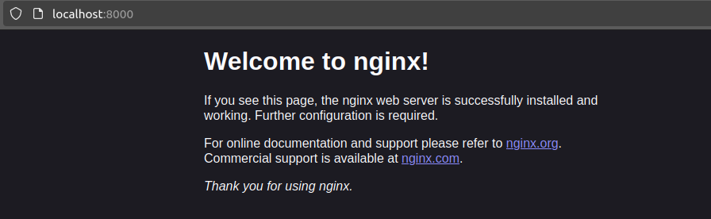

# Terraform

Version installed: v1.8.5
```
$ terraform -v

Terraform v1.8.5
on linux_amd64
```

## Installation and Prerequisites

1. Via the Manual Installation method, I unzipped and moved to the PATH the ```terraform``` binary file
2. Make a configuration file ```learn-terraform-docker-container/main.tf ``` (a copy is stored in lab5 directory)

## Build

1. Directory is initialized with the ```terraform init```. Done through a VPN as the service is unavailable otherwise.

```
$ terraform init

Initializing the backend...

Initializing provider plugins...
- Reusing previous version of kreuzwerker/docker from the dependency lock file
- Using previously-installed kreuzwerker/docker v3.0.2

Terraform has been successfully initialized!

You may now begin working with Terraform. Try running "terraform plan" to see
any changes that are required for your infrastructure. All Terraform commands
should now work.

If you ever set or change modules or backend configuration for Terraform,
rerun this command to reinitialize your working directory. If you forget, other
commands will detect it and remind you to do so if necessary.

```

2. A docker daemon is set to run in the background for the terraform to apply
```
$ systemctl status docker
● docker.service - Docker Application Container Engine
     Loaded: loaded (/lib/systemd/system/docker.service; enabled; vendor preset>
     Active: active (running) since Thu 2024-06-27 15:02:42 MSK; 1min 17s ago
TriggeredBy: ● docker.socket
       Docs: https://docs.docker.com
   Main PID: 10349 (dockerd)
      Tasks: 10
     Memory: 27.3M
     CGroup: /system.slice/docker.service
             └─10349 /usr/bin/dockerd -H fd:// --containerd=/run/containerd/con>

июн 27 15:02:42 shmango systemd[1]: Starting Docker Application Container Engin>
июн 27 15:02:42 shmango dockerd[10349]: time="2024-06-27T15:02:42.340016479+03:>
июн 27 15:02:42 shmango dockerd[10349]: time="2024-06-27T15:02:42.341155545+03:>
июн 27 15:02:42 shmango dockerd[10349]: time="2024-06-27T15:02:42.482013430+03:>
июн 27 15:02:42 shmango dockerd[10349]: time="2024-06-27T15:02:42.779173805+03:>
июн 27 15:02:42 shmango dockerd[10349]: time="2024-06-27T15:02:42.811833918+03:>
июн 27 15:02:42 shmango dockerd[10349]: time="2024-06-27T15:02:42.812034789+03:>
июн 27 15:02:42 shmango dockerd[10349]: time="2024-06-27T15:02:42.864591291+03:>
июн 27 15:02:42 shmango systemd[1]: Started Docker Application Container Engine.
```

3. Provisioning the NGINX server contrainer with apply:
```
$ systemctl status docker
● docker.service - Docker Application Container Engine
     Loaded: loaded (/lib/systemd/system/docker.service; enabled; vendor preset>
     Active: active (running) since Thu 2024-06-27 15:02:42 MSK; 1min 17s ago
TriggeredBy: ● docker.socket
       Docs: https://docs.docker.com
   Main PID: 10349 (dockerd)
      Tasks: 10
     Memory: 27.3M
     CGroup: /system.slice/docker.service
             └─10349 /usr/bin/dockerd -H fd:// --containerd=/run/containerd/con>

июн 27 15:02:42 shmango systemd[1]: Starting Docker Application Container Engin>
июн 27 15:02:42 shmango dockerd[10349]: time="2024-06-27T15:02:42.340016479+03:>
июн 27 15:02:42 shmango dockerd[10349]: time="2024-06-27T15:02:42.341155545+03:>
июн 27 15:02:42 shmango dockerd[10349]: time="2024-06-27T15:02:42.482013430+03:>
июн 27 15:02:42 shmango dockerd[10349]: time="2024-06-27T15:02:42.779173805+03:>
июн 27 15:02:42 shmango dockerd[10349]: time="2024-06-27T15:02:42.811833918+03:>
июн 27 15:02:42 shmango dockerd[10349]: time="2024-06-27T15:02:42.812034789+03:>
июн 27 15:02:42 shmango dockerd[10349]: time="2024-06-27T15:02:42.864591291+03:>
июн 27 15:02:42 shmango systemd[1]: Started Docker Application Container Engine.
```
Visiting the (http://localhost:8000/)[http://localhost:8000/] un my browser shows:



4. Verifying state
List of the resources in your project's state.
```
$ terraform state list

docker_container.nginx
docker_image.nginx
```

## Change
1. Update configuration, by changing the external port number. Changes to ```main.tf``` file have been written to the separate ```main_changes.tf``` file. The changes are taken from the tutorial page as follows:
```
resource "docker_container" "nginx" {
  image = docker_image.nginx.latest
  name  = "tutorial"
  hostname = "learn-terraform-docker"
  ports {
    internal = 80
-   external = 8000
+   external = 8080
  }
}

```
2. Apply the changes using ```terraform apply``` command
```
Terraform will perform the following actions:

  # docker_container.nginx must be replaced
-/+ resource "docker_container" "nginx" {
...

~ ports {
          ~ external = 8000 -> 8080 # forces replacement
            # (3 unchanged attributes hidden)
        }
    }

Plan: 1 to add, 0 to change, 1 to destroy.

Do you want to perform these actions?
  Terraform will perform the actions described above.
  Only 'yes' will be accepted to approve.

  Enter a value: yes

docker_container.nginx: Destroying... [id=b2135af8eeccd857a411b1289006ded09ed737256c7df24019726de158c94316]
docker_container.nginx: Destruction complete after 0s
docker_container.nginx: Creating...
docker_container.nginx: Creation complete after 0s [id=a74a065c34cccdefba6d8cd279f6e461e15a46156091de62c0222cbc74b6c80d]

Apply complete! Resources: 1 added, 0 changed, 1 destroyed.

```

## Destroy
The ```terraform destroy``` command terminates resources managed by the Terraform project. 
```
$ terraform destroy

Terraform will perform the following actions:

  # docker_container.nginx will be destroyed
  - resource "docker_container" "nginx" {
...
  # docker_image.nginx will be destroyed
  - resource "docker_image" "nginx" {
      - id           = "sha256:e0c9858e10ed8be697dc2809db78c57357ffc82de88c69a3dee5d148354679efnginx" -> null
      - image_id     = "sha256:e0c9858e10ed8be697dc2809db78c57357ffc82de88c69a3dee5d148354679ef" -> null
      - keep_locally = false -> null
      - name         = "nginx" -> null
      - repo_digest  = "nginx@sha256:9c367186df9a6b18c6735357b8eb7f407347e84aea09beb184961cb83543d46e" -> null
    }

Plan: 0 to add, 0 to change, 2 to destroy.

Do you really want to destroy all resources?
  Terraform will destroy all your managed infrastructure, as shown above.
  There is no undo. Only 'yes' will be accepted to confirm.

  Enter a value: yes

docker_container.nginx: Destroying... [id=a74a065c34cccdefba6d8cd279f6e461e15a46156091de62c0222cbc74b6c80d]
docker_container.nginx: Destruction complete after 0s
docker_image.nginx: Destroying... [id=sha256:e0c9858e10ed8be697dc2809db78c57357ffc82de88c69a3dee5d148354679efnginx]
docker_image.nginx: Destruction complete after 1s

Destroy complete! Resources: 2 destroyed.

```

# Observations and challenges
The main obstacle in the building process was the required VPN