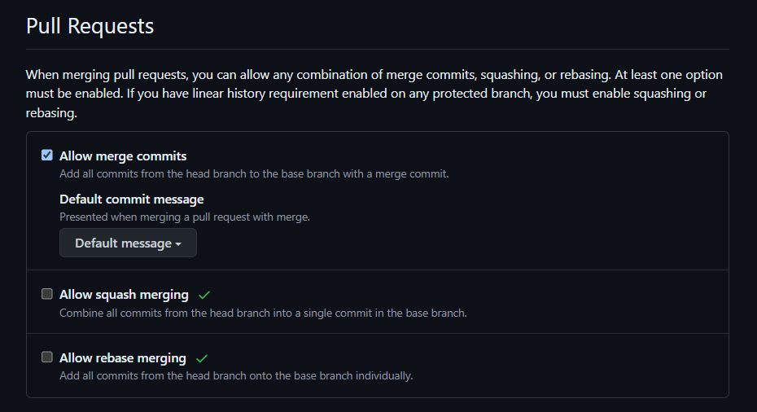

# Lab 1 

## Task one

### Signed Commits
Signing commits adds a layer of authenticity and security to the commit history. Here are some benefit of signing commits.

- **Authenticity** : Signing commits provides a way to verify the identity of the commit author to ensures that the commits are indeed made by the claimed author and not an imposter.
- **Accountability** : Signed commits create a verifiable trail of changes,which can help in holding developers accountable for their commits.
- **Security and compliance** : Signed commits help prevent bad actors from inserting malicious code into the project by impersonating a legitimate contributor.They also help repository administrators when they need to enforce certain rules on a repositories branch e.g requiring a commit signature on a branch to block all commits that are not signed and verified.

## Task Two 
### 1. Standard Merge
The standard merge strategy combines two branches by creating a merge commit. This commit records the merge event and the branches' histories remain unchanged.
#### Pros
- Preserves History: Maintains the complete history of all changes.
- Conflict Tracking: Clearly shows when and how conflicts were resolved before merges.
#### Cons
- Commit History: Can lead to a cluttered commit history, especially with many merges.
- Complexity: Can be harder to trace the lineage of individual commits.

This merge startegy Preferred in collaborative environments because it retains the full project history, making it easier for team members to understand the evolution of the project it also makes it easier to debug issues by looking at past merge commits.
### 2. Squash and Merge
This strategy combines all commits from a feature branch into a single commit before merging it into the main branch.

#### Pros
- Clean commit History: Results in a clean, linear commit history.
- Single Commit: It ensures each merge represents a single, cohesive set of changes which makes it easier to revert changes if necessary.
#### Cons
- Lost Context: A detailed commit history from the feature branch is lost.
- Conflict Resolution: If conflicts arise, resolving them in a single commit can be challenging if the source of the conflicts is from multiple files.

### 3. Rebase and Merge
Rebase and merge reapplies commits from a feature branch onto the base branch, effectively replaying the feature branch commits on top of the base branch.

#### Pros
- Linear History: Maintains a linear project history without merge commits.
- Clear and clean Project Timeline: Easier to follow the project's progression over time it also avoids extra merge commits which helps keep commit logs clean.

#### Cons
- History Rewriting: Alters commit history, which can be problematic in shared repositories.
- Complex strategy : The learning curve for rebase can be steep for teams and developers making it difficult to newer developers to grasp.

# I disabled squash and rebase merge for the branch

