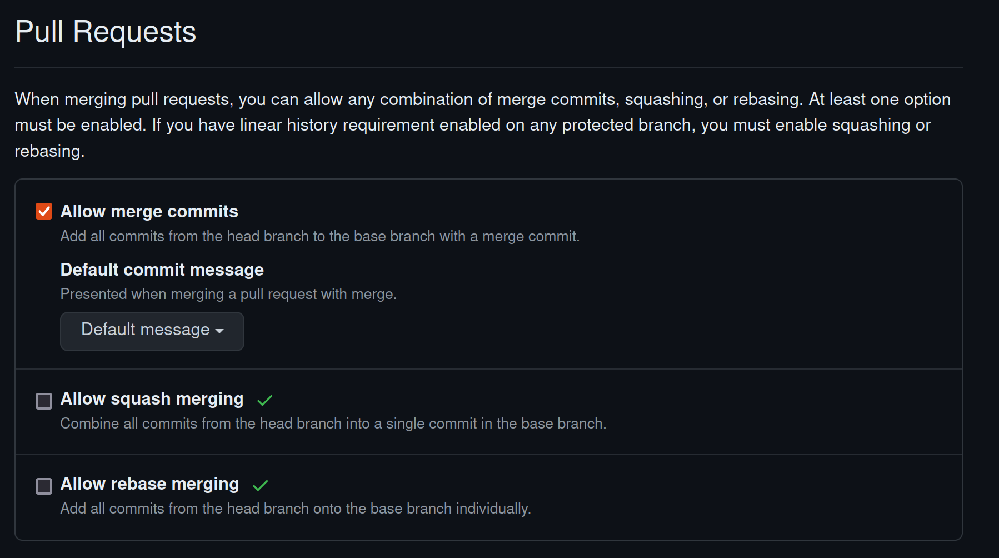

# Lab 1

## Commit Signing
Signing Git commits on GitHub involves using GPG, SSH, or S/MIME to verify the authenticity and integrity of the code changes. Verified signatures ensure that commits are genuinely from the claimed author and have not been tampered with, thus enhancing security and trust within the repository. This practice provides accountability for contributors and allows repository administrators to enforce required commit signing, preventing unsigned commits.

## Merge strategies
### Standard Merge
- **Description**: Combines two branches by creating a merge commit.
- **Pros**: Maintains complete history, clear merge record.
- **Cons**: Can create cluttered history with many merge commits.
- **Preferred For**: Collaborative environments due to its clear history of how and when branches were integrated.

### Squash and Merge
- **Description**: Combines all commits from a feature branch into a single commit before merging.
- **Pros**: Clean, concise history; simplifies tracking of feature changes.
- **Cons**: Loses individual commit history from the feature branch.
- **Preferred For**: Single developer projects or when individual commit details are less important.

### Rebase and Merge
- **Description**: Reapplies commits from a feature branch onto the base branch.
- **Pros**: Linear, clean history without merge commits.
- **Cons**: Rewriting history can be complex and risky, especially for shared branches.
- **Preferred For**: Maintaining a clean project history when used carefully.

### Summary
The standard merge strategy is often preferred in collaborative environments because it maintains a complete and transparent history of changes, showing when and how branches are integrated. This clarity is crucial for teamwork and effective project management.

### Disabling rebase and squash merge

