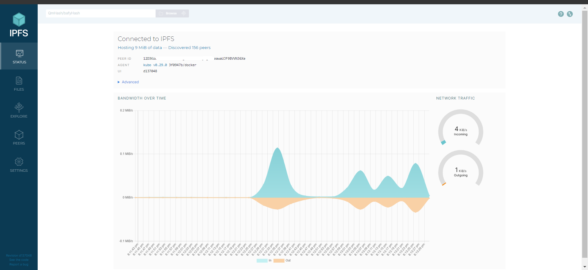
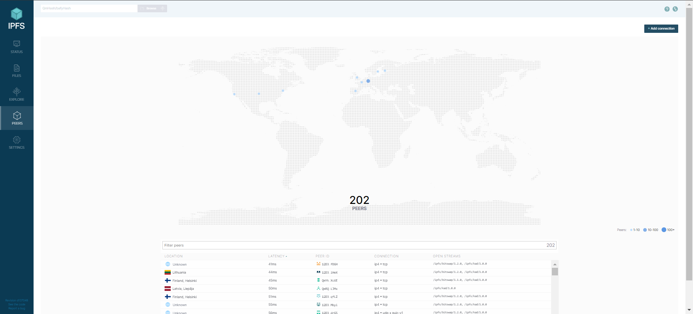
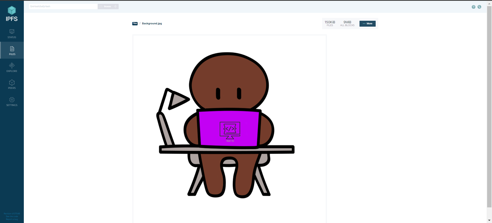
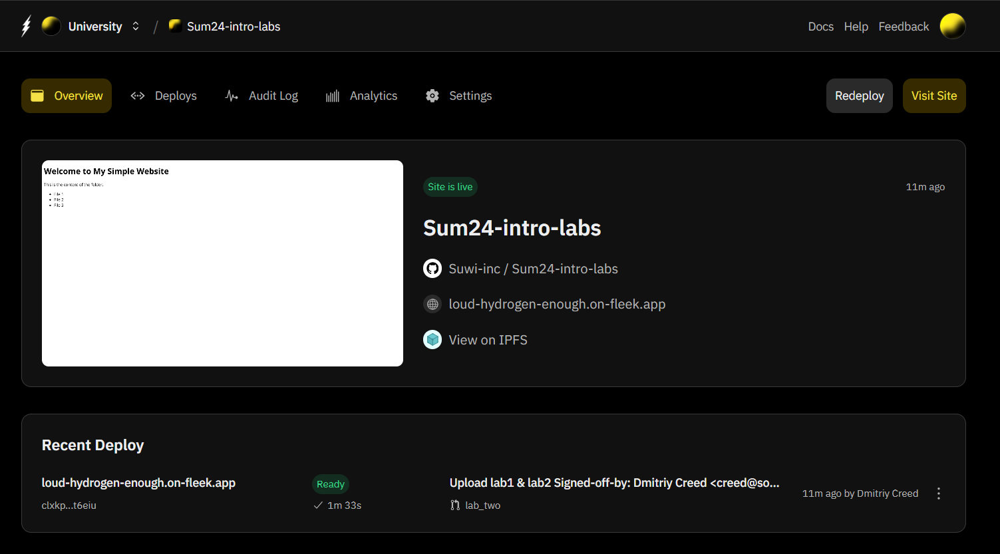

# Lab 2
## Task one

###  Connected peers and bandwidth



## Uploaded File


- **File Hash**
 ```sh 
 QmcC2fWYdpSyQqTFABeEfcEeo2DwNzjQ4UwQRby9Kufzj7
 ```
- **File URL**
```sh
https://ipfs.io/ipfs/QmcC2fWYdpSyQqTFABeEfcEeo2DwNzjQ4UwQRby9Kufzj7?filename=Background.jpg
```
## Task two

- **IPFS Hash**
```sh
bafybeiemh62uxfe2ihc5evzswtovpnugh5eh2j6oqlrebpz7yjqch6zfp4
```
- **IPFS Link to deployed site**
```sh
https://ipfs.io/ipfs/bafybeiemh62uxfe2ihc5evzswtovpnugh5eh2j6oqlrebpz7yjqch6zfp4
```
- **Fleek issued domain**
```sh
https://loud-hydrogen-enough.on-fleek.app/
```
### Fleek dashboard with deployed site



