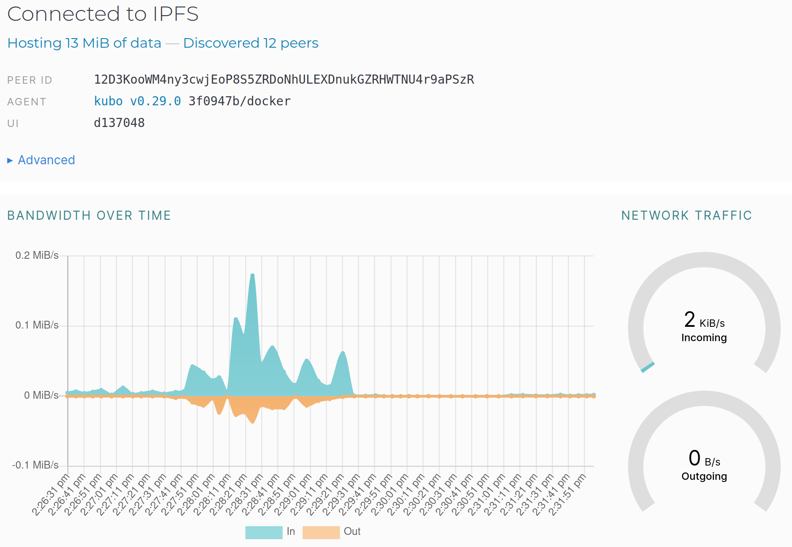

# Lab 2: DevOps Tool Exploration
## Anton Buguev, a.buguev@innopolis.university, M23-RO-01

### Task 1. IPFS Gateway Using Docker.

- **My peer ID**: 12D3KooWM4ny3cwjEoP8S5ZRDoNhULEXDnukGZRHWTNU4r9aPSzR
- **Hash**: QmY9cxiHqTFoWamkQVkpmmqzBrY3hCBEL2XNu3NtX74Fuu
- **URL**: https://ipfs.io/ipfs/QmY9cxiHqTFoWamkQVkpmmqzBrY3hCBEL2XNu3NtX74Fuu?filename=file.txt

### Task 2. Fleek.co

- [**Domain**](https://wailing-grass-narrow.on-fleek.app/)
- [**IPFS Link**](https://ipfs.io/ipfs/bafybeiemh62uxfe2ihc5evzswtovpnugh5eh2j6oqlrebpz7yjqch6zfp4)