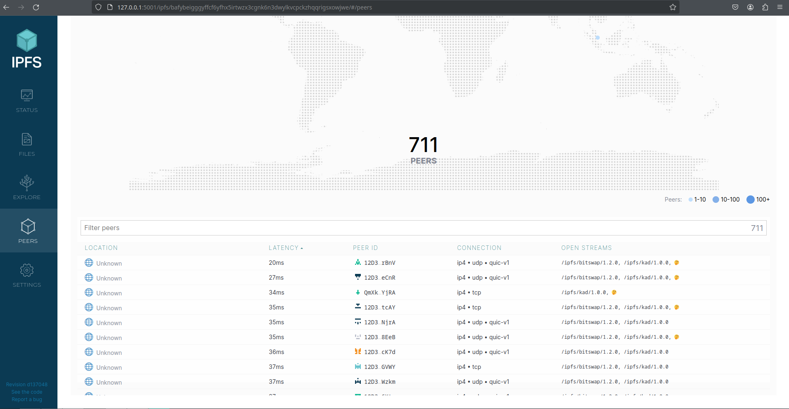
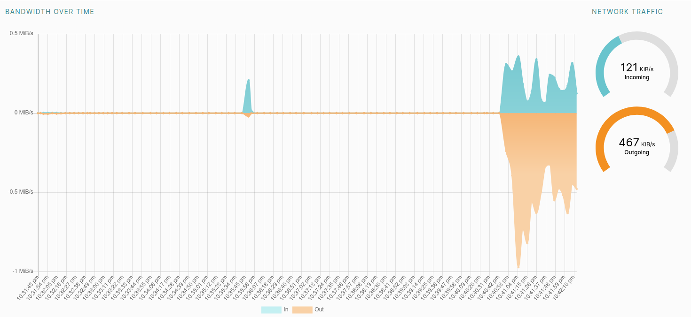

# Task 1
I managed to run IPFS locally and import the text file to IPFS.
The text file can be found on the [pablic gateway](https://bafybeiaagam4ixvhpsfrmea5liv2jkciaefoc6naiyugrdng26fo7sk4jy.ipfs.dweb.link/).  
CID: QmNMPFTFRQKnySDsg98PdzpHDQM4cVE7D33zdjcZZhAaFP

The peers connected can be seen on the picture below.

The bandwidth can be seen on the picture below.

# Task 2

URL: https://dweb.link/ipfs/bafybeiemh62uxfe2ihc5evzswtovpnugh5eh2j6oqlrebpz7yjqch6zfp4
Domain: https://millions-notebook-modern.on-fleek.app/
