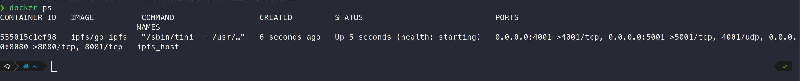
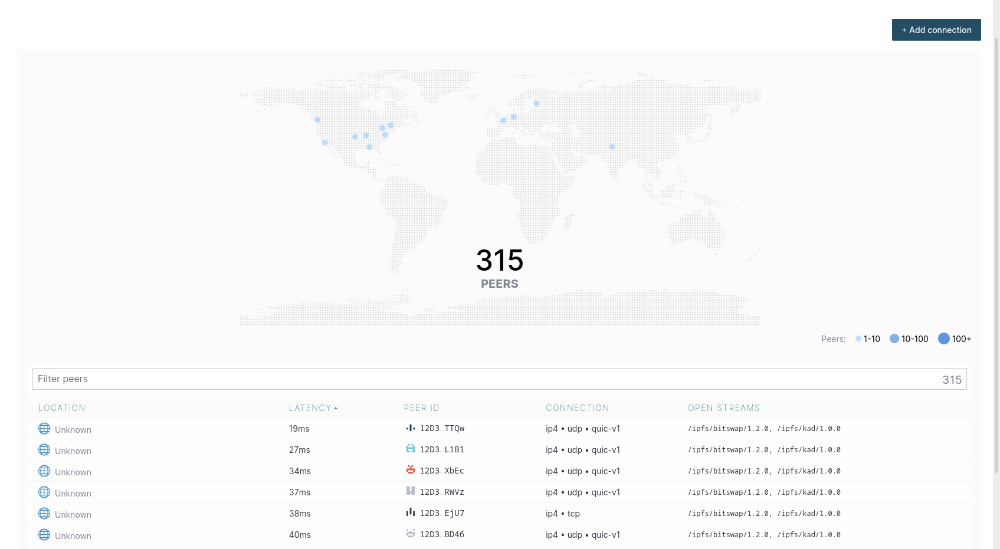
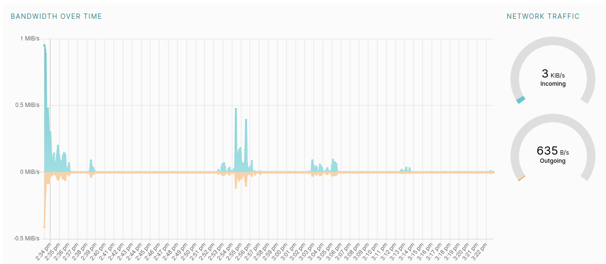

# Lab 1

## Task 1

File Hash: `QmRm5jtwya1FgWU3ihs1LGi6uxxDUtaUkGN9yF72jgpn9a`

Link through a public gateway: https://ipfs.io/ipfs/QmRm5jtwya1FgWU3ihs1LGi6uxxDUtaUkGN9yF72jgpn9a

## Task 2

Site URL: https://tiny-animal-tiny.on-fleek.app/

Site IPFS Hash: `bafybeiemh62uxfe2ihc5evzswtovpnugh5eh2j6oqlrebpz7yjqch6zfp4`

Site IPFS URL: https://ipfs.io/ipfs/bafybeiemh62uxfe2ihc5evzswtovpnugh5eh2j6oqlrebpz7yjqch6zfp4/